# FinePrint

FinePrint is the agent that sits between you and the “I Agree” button.

It is an **agent-ready consent interface**: people can understand and make informed choices before they agree to a website’s terms, privacy settings, payments, and permissions. Publishers declare those choices as a structured, testable **consent contract** that a human and their agent inspect through WebMCP.

The goal is not to make publishers trustworthy. State-changing tools require on-page confirmation, so the human stays in the loop.

This is a static hackathon demo. It never collects information, starts a subscription, requests real permissions, or sends data anywhere.

The ten decorative poster backgrounds are local, cropped Unsplash images. Their source manifest is in [`assets/posters/SOURCES.md`](assets/posters/SOURCES.md).

## What it demonstrates

The page contains five realistic traps:

1. Cookie consent with a pre-checked partner-sharing choice and a visually dominant accept button.
2. A bundled Terms checkbox plus a long Terms and Privacy Policy modal with the arbitration clause buried in ordinary legal text.
3. A free trial that converts to $49.99 per month after 14 days.
4. A recommendation prompt that asks for precise location, contacts, and notifications.
5. A founding-price countdown that resets on reload and sells an annual plan.

Each interactable choice has a machine-readable policy declaration embedded in `index.html`. Clause text lives in the legal document with stable `data-clause-id` attributes. Tools read those sources at runtime so an agent can explain the declared contract in plain language. 

The FinePrint dock on the page states the consent-interface framing, copies a judge prompt, logs agent tool activity, and resets the demo.

## WebMCP tool surface

| Tool | Type | Purpose |
| --- | --- | --- |
| `listConsentDecisions` | Read-only | Lists every decision group, choice id, label, and default-selected flag.  |
| `getChoiceDetails` | Read-only | Returns the decision group, default-selection state, and policy references. |
| `getDecisionImpact` | Read-only | Returns data sharing, financial commitment, renewal, reversibility, and timing. |
| `getAvailableChoices` | Read-only | Lists alternatives in the same decision group and their declared impacts. |
| `getPolicyReferences` | Read-only | Returns clause ids and on-page labels that govern a choice. |
| `getPolicySection` | Read-only | Returns the full text of a terms, cookie, or permission section. |
| `showPolicySection` | Read-only | Opens the legal document, scrolls to the clause, and highlights it. |
| `setPrivacyPreference` | State-changing | Applies a privacy-protective demo preference after confirmation. |
| `lockInTimerState` | State-changing | Freezes the demo timer after confirmation and makes the no-deadline state visible. |
| `applySaferDefaults` | State-changing | Applies the safer declared option for **one** decision after confirmation. Pass `cookie-consent`, `account-terms`, `trial-membership`, `recommendation-permissions`, or `founding-member-offer`. |
| `resetDemo` | State-changing | Restores cookie, terms, trial, timer, and receipt state for another run. |

Read-only tools have `readOnlyHint: true` and highlight related UI. State-changing tools (except `resetDemo`) open an in-page confirmation sheet. After a confirmed action, the page keeps the safer state visible and logs the call in the FinePrint dock.

## Devpost architecture

```mermaid
flowchart LR
    A[User visits a streaming site] --> B[FinePrint consent UI]
    B --> C[Dark-pattern choices hidden in normal flow]
    C --> D[WebMCP agent inspects page and policy]
    D --> E[Explains impact and legal text]
    E --> F[User reviews safe options]
    F --> G[Human confirms before change]
    G --> H[Safer choice applied]
    H --> I[Page stays transparent and in control]
```



This is the simplest Devpost-friendly view: the site presents consent decisions, the agent reads and explains them, and the user remains in the loop before anything changes.

## Run locally

Serve this directory from a local HTTP server, then open it in a WebMCP-enabled browser:

```sh
python3 -m http.server 4173 --bind 127.0.0.1
```

Open [http://127.0.0.1:4173](http://127.0.0.1:4173). The page works normally in browsers without WebMCP; the dock reports that agent tools are unavailable.

To test in Google Chrome, enable `chrome://flags/#enable-webmcp-testing`. Judges can also open the deployed URL in ChatGPT’s in-app browser.

Run the policy-contract check with:

```sh
python3 -m unittest tests/test_policy_contract.py
```
